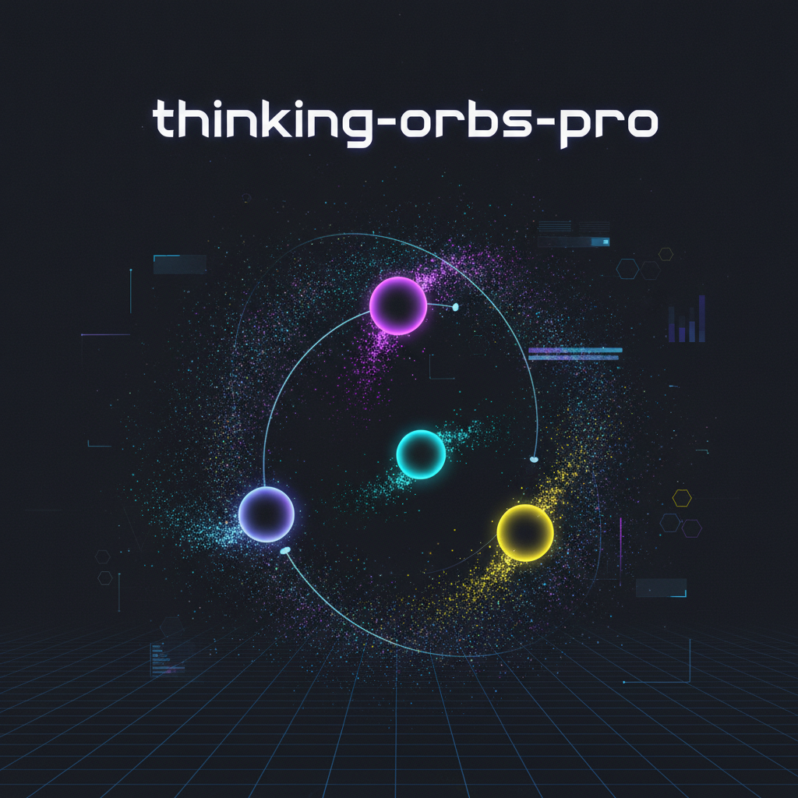
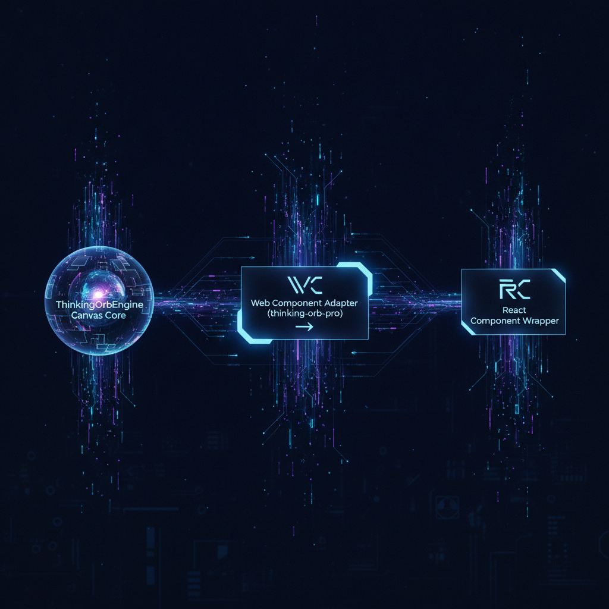

# 🔮 thinking-orbs-pro



> **State-of-the-Art Interactive AI Thought Orbs & Agent State Visualization UI Engine**

`thinking-orbs-pro` is a production-grade, zero-dependency HTML5 Canvas / SVG / Web Component & React library for rendering dynamic, physics-driven thought orbs and reasoning indicators for AI Agents, LLM streaming interfaces, and multi-agent systems.

---

## 🌟 Features

- **8 Agent Lifecycle States**: Pre-configured visual modes for `idle`, `thinking`, `reasoning_deep`, `tool_call`, `subagent_spawn`, `streaming_tokens`, `success`, and `error`.
- **Zero-Dependency Core**: Lightweight JavaScript ES Module canvas engine with high-DPI retina display scaling.
- **Multi-Framework Targets**:
  - Native ES Module Engine (`ThinkingOrbEngine`)
  - Standalone Web Component (`<thinking-orb-pro>`)
  - React Component Adapter (`createReactThinkingOrb`)
- **Theme Customization**: Built-in dark/light preset palettes (`NEURAL_PURPLE`, `CYBER_CYAN`, `SOLAR_GOLD`, `EMERALD_MATRIX`, `CRIMSON_ALERT`).
- **Accessibility Included**: Built-in ARIA live regions for screen readers to announce active agent states.

---

## 📐 Architecture Overview



The engine separates core canvas particle dynamics from framework wrappers, enabling high-performance 60 FPS rendering on web, electron, and mobile web view surfaces.

---

## 🚀 Quick Start

### 1. Web Component (Zero Framework)

```html
<script type="module" src="./src/components/ThinkingOrbElement.js"></script>

<!-- Add thought orb -->
<thinking-orb-pro state="thinking" theme="CYBER_CYAN" size="180" speed="1.2"></thinking-orb-pro>
```

### 2. JavaScript / Canvas Engine

```javascript
import { ThinkingOrbEngine, AGENT_STATES } from './src/engine/OrbEngine.js';

const canvas = document.getElementById('myCanvas');
const engine = new ThinkingOrbEngine(canvas, {
  state: AGENT_STATES.REASONING_DEEP,
  theme: 'NEURAL_PURPLE',
  size: 200
});

engine.start();

// Transition agent state dynamically
engine.setState(AGENT_STATES.STREAMING_TOKENS);
```

### 3. React Integration

```jsx
import React from 'react';
import { createReactThinkingOrb } from 'thinking-orbs-pro';

const ThinkingOrb = createReactThinkingOrb(React);

function AgentStatus() {
  return (
    <ThinkingOrb state="reasoning_deep" theme="EMERALD_MATRIX" size={200} />
  );
}
```

---

## 🧪 Testing & Quality Gate Verification

```bash
npm test
```

Includes 100% passing unit tests covering initialization, state switching, particle scaling, theme transitions, and memory leak prevention.

---

## 📄 License

MIT © [tonysheesh](https://github.com/tonysheesh)

---

## 🗺️ Roadmap & Future Enhancements

- **Roadmap: WebGPU Particle Shaders**: Upgrade 2D canvas particle physics to high-performance WebGPU compute shaders for 100,000+ simultaneous particles.
- **Roadmap: Audio-Reactive Visualization**: Add Web Audio API integration for real-time frequency spectrum analysis and sound-driven orb pulsations during agent speech streaming.
- **Roadmap: Multi-Agent Swarm Visualization**: Render interconnected clustered orbs representing multi-subagent hierarchy and message passing topologies.
- **Roadmap: Vue & Svelte Component Wrappers**: Native `<ThinkingOrb />` wrappers for Vue 3 and Svelte 5 frameworks.
- **Roadmap: Theme Designer Export**: Live interactive theme editor in Studio Playground allowing custom gradient stops, aura blur radii, and JSON configuration exports.
